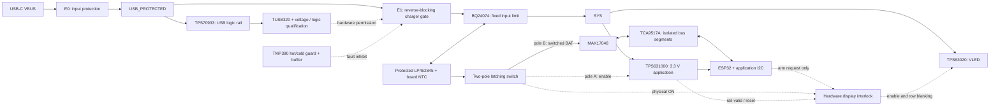

<!-- SPDX-License-Identifier: CERN-OHL-S-2.0 -->

# Complete power architecture proposal

2026-10-05 • Baseline `0764245` • [Proposed ADR 0018](../decisions/0018-complete-power-architecture-proposal.md)

**Review recommendation, not a completed electrical design.** This document covers the whole power system and makes a preferred topology explicit. Component facts are manufacturer specifications; numeric examples are calculations with stated assumptions. There are no simulations or bench measurements in this package. Six capture holds remain below. The 2026-10-09 amendment below selects an exact pack as the Rev A design target; supplier availability and physical qualification remain open.

## 1. Proposed circuit and power domains

Arrows express functional connections, not pin-complete wiring. USB data retains its separate application-powered TS3USB31E path. Grounds are common: the I²C buffer is **not galvanic isolation**.

| Block | Preferred proposal | Connection and state contract |
|---|---|---|
| E0 input protector | `TPS259474ARPWR`, already audited candidate library | Connector to `USB_PROTECTED`; autonomous voltage/fault protection, independent of Type-C permission and physical ON. It must start the detector without the charger connected. |
| USB logic | Existing `TPS70933DBVR`, `TUSB320LAIRWBR`, conditioning logic and `TPS3808G01DBVR` | Powered from protected USB only. Preserve source classification, delayed rail qualification and source-voltage qualification as distinct functions. |
| E1 charger gate | Second `TPS259474ARPWR` | `USB_PROTECTED` to `CHARGER_IN`; no request means open. Reverse blocking prevents stored downstream energy driving the detector supply during source removal. |
| Charger | `BQ24074RGTR` | IN from E1; OUT to SYS; BAT to protected pack without an on-board measurement shunt under ADR 0021; CE low, EN1 low, EN2 high from a qualified **gated-input** network. Do not power the mode pull-up from BAT. |
| Pack | LiPol `LP452845`, finished assembly FD_6225_10 index 1 (ADR 0024) | Protected 1S, `PHR-2` to board `S2B-PH-SM4-TB`; battery-facing board NTC on BQ TS and TMP390 hardware guard on E1. Charger BAT remains connected in physical OFF. |
| Physical switch | Existing `JS202011JAQN` candidate, still requiring full audit | Pole A: SYS-derived control signal for application enable/interlock. Pole B: protected BAT to gauge domain. No matrix/application load through the contacts. No assumed relative contact timing. |
| Application supply | `TPS631000DRLR` staged candidate | SYS input, 3.308 V nominal, physical enable with independent pull-down; retain the staged exact inductor, parallel capacitors and feedback pair. |
| LED supply | `TPS63020DSJT` | SYS input, existing 3.944 V nominal proposal; enable only through hardware interlock. No current-limit increase. |
| Gauge | `MAX17048G+T10` plus proposed `TCA9517ADGKR` | Gauge measures switched protected BAT; separate gauge-side and application-side pull-ups. Buffer is a new candidate, not a BOM selection. |
| Current sensing | External inline instrument during validation (ADR 0021) | No on-board INA232 or series measurement shunt; firmware uses the MAX17048 for battery voltage/SOC, without live signed current telemetry. |

**What changes:** E1 substitutes a physical input disconnect for dynamic charger mode-pin actuation; the gauge bus gains a buffer; charge-current planning decreases. **What stays:** Type-C-only charging, autonomous OFF charge, battery-only USB-A/default-current operation, physical OFF, fixed brightness, two converters and existing display architecture.

For validation, place the inline current instrument in a correctly polarized protected-pack test harness and account for its burden voltage; keep pack protection and the charger NTC arrangement intact. On USB-only operation SYS may exist with no cell: pole A must therefore be SYS-derived, while pole B remains battery-derived; a missing gauge must not be mistaken for a charged battery.

## 2. USB admission and protection

The stable request remains `VBUS_VALID AND LOGIC_READY AND TYPE_C_HIGH`, where TYPE_C_HIGH means the detector advertises 1.5 A or 3 A. MCU requests, enumeration and suspend state cannot raise it. E0 protects the detector rail even when E1 is open. This avoids the circular startup of a detector powered behind its own permission switch.

Use E1 EN as an active-high wired-AND node: a pull-up to the **supervised USB logic rail**, an independent default pull-down, and open-drain inhibits for invalid logic and absent source permission. A more promising request-inhibit candidate is `SN74AUP1G125DBVR`: tie A to ground, connect its active-low OE to the existing active-high `USB_CHARGE_REQ`, and connect Y to EN. Thus absent permission drives EN low; permission makes Y high-impedance and allows the pull-up to raise EN after supervisor release. U23's inverted open-drain output must **not** be wired directly to E1 EN. The candidate's 0.8–3.6 V supply range and published three-state output leakage improve the low-supply screen relative to `SN74LVC1G07DBVR`, but do not prove the transient circuit. Revise the full conditioning network together, including existing pull-ups, pull-downs and Schmitt loads. No resistor MPNs are selected here. The earlier 270 kΩ example is not an approved network.

TPS3808's 0.8 V POR entry is the supply point where reset becomes available under its stated loading/rise condition, with a 0.2 V output condition; it is not a generic 0.8 V output clamp. Its power-up condition does not supply a maximum response time for every fast falling rail. The EN proof must include passive behavior below POR, intermediate supplies, gate leakage, capacitor injection and rail collapse. [TPS3808 §6.5](https://www.ti.com/lit/ds/symlink/tps3808.pdf), [SN74LVC1G07 §§5.3–5.5](https://www.ti.com/lit/ds/symlink/sn74lvc1g07.pdf).

**H3 static screening increment, 2026-10-05.** Move U34's VDD, MR/CT references and RESET pull-up from the current protected 5 V connection to the same USB 3.3 V logic rail as E1's EN pull-up. RESET would independently sink EN until the supervised rail passes its threshold and release delay. The existing 620 kΩ / 100 kΩ sense ratio may be reused only after recalculation in the completed circuit. For an illustrative 220 kΩ pull-up and 1 MΩ pull-down, each ±1%, the pull-up sources at most 3.67 µA at a 0.8 V rail and 16.53 µA at a 3.6 V rail at zero EN voltage. These are below the TPS3808's 15 µA power-up RESET test load at 0.8 V and the AUP gate's 20 µA / 0.1 V LOW row, respectively, **before** other currents. With a hypothetical net 0.9 µA EN sink, the minimum calculated EN HIGH is 2.287 V at a 3.0 V rail, above the TPS25947's 1.223 V maximum rising threshold. This is a resistor sensitivity screen, not an established 0.9 µA all-condition leakage bound: AUP `IOZ` is specified at 3.6 V, its `Ioff` at 0 V, and neither row bounds all intermediate supplies and output voltages. At least the 0.8 V-to-valid-rail start, fast brownout, U23 start/release, output injection, supervisor response, and all attached EN-pin currents remain to be proven. [SN74AUP1G125 §§6.3–6.7](https://www.ti.com/lit/ds/symlink/sn74aup1g125.pdf), [TPS3808 §6.5](https://www.ti.com/lit/ds/symlink/tps3808.pdf), [TPS25947 §6.5](https://www.ti.com/lit/ds/symlink/tps25947.pdf).

The [pin-boundary follow-on](charger-permission-boundary-2026-10-07.md) records the proposed E1/AUP/U34/BQ connections and required source states together. It exposes BQ `EN2` voltage/timing as an unresolved concrete pin rather than treating the charger mode as an abstract Boolean grant. ADR 0024 adds a second AUP output as a temperature-fault sink on E1 EN, driven by a separate 10 kΩ-pulled TMP390 output node; the direct 220 kΩ connection is rejected. The temperature subcircuit is root-linked as of 2026-10-10, with its BQ TS and E1 EN boundaries still open.

The 0.9 µA illustration adds AUP three-state leakage 0.5 µA, supervisor RESET leakage 0.3 µA and eFuse EN leakage 0.1 µA. Those published maxima are taken at **different pin voltages and supply conditions**; summing them does not make a guaranteed EN leakage bound at the actual 2–3 V node. The AUP datasheet also limits OE input transition time to 200 ns/V. The present U23 open-drain request and its pull-up, trace and test-pad capacitance must meet that limit in the captured circuit, including release after a detector state change. Keep Y's pull-up on the AUP supply rail; TI's application guidance says not to pull an output above VCC. [SN74AUP1G125 §§6.3, 6.6 and 9](https://www.ti.com/lit/ds/symlink/sn74aup1g125.pdf), [TPS3808 §6.5](https://www.ti.com/lit/ds/symlink/tps3808.pdf).

The existing **38.3 kΩ / 10 kΩ numerical OVLO screen** gives 5.620–6.006 V rising and 5.112–5.480 V falling, including the stipulated ±1% total resistance error and signed input leakage. It offers more normal-5.5 V margin than 37.4 kΩ / 10 kΩ. Prefer it for further calculation, not population. Following an OV trip, recovery at 5.5 V is not assured; require a return below the guaranteed recovery boundary or detach. This proposal explicitly accepts disconnect/reconnect after a fault; a normally attached 5.5 V source still has to work.

E0/E1 are circuit-breaker variants, **not constant-current clamps**. Their threshold/timer, short-circuit transient and retry behavior must be coordinated with charger startup and capacitor charging. The old 3.32 kΩ example can trip at 0.850 A, below the charger's 0.975 A high corner; it is not a completed selection. No fuse threshold is raised by this proposal. E0 must cover both USB logic and charger branches. All capacitance charged before the BQ input limiter belongs in the port inrush analysis. OVLO is a disconnect threshold, not a transient clamp; size connector-side suppression/capacitors and bound protected-rail overshoot before capture. [TPS25947 §§4–8](https://www.ti.com/lit/ds/symlink/tps25947.pdf).

**H2 current-coordinate screen, 2026-10-05.** TI's guaranteed threshold rows are specified at discrete ILM resistances. Compare them to the **unchanged** BQ24074 charger-input high corner, 0.975238 A; E0 additionally supplies USB logic and E1 sees charger-input capacitor charging before the BQ current regulator can act.

| TPS259474 ILM test point | Published minimum / maximum breaker threshold | Consequence for a qualified 1.5 A source |
|---|---:|---|
| 6.65 kΩ | 0.425 / 0.575 A | Below the charger-input corner. |
| 3.32 kΩ | 0.850 / 1.150 A | Minimum still below the charger-input corner; even E1 could trip during valid charge-through. |
| 1.65 kΩ | 1.800 / 2.200 A | Both guaranteed values exceed 1.5 A, so this setting cannot be presented as a 1.5 A source-current ceiling. |

The datasheet's `3334/RILM` equation gives **nominal design guidance**, not a guaranteed min/max curve between those rows. An intermediate resistor might clear the 0.975 A charger corner and avoid unwanted trips, but selecting one requires a manufacturer-backed tolerance bound, exact resistor error, auxiliary-current sum and inrush/fault analysis. Even a breaker threshold below 1.5 A would not be a hard instantaneous source limit: the 474 allows transient overcurrent during its ITIMER blanking interval and describes a separate approximately twice-ILIM fast-trip path. The BQ24074's fixed input limit remains the steady charge-path limiter; E0's detector loads and both eFuse startup capacitor currents still count toward the USB source. No ILM or timer value is approved by this screen. [TPS25947 §§6.5, 7.3.5](https://www.ti.com/lit/ds/symlink/tps25947.pdf), [BQ24074 input-current table](https://www.ti.com/lit/ds/symlink/bq24074.pdf).

**Lower-current simplification proposal, 2026-10-07:** [ADR 0022](../decisions/0022-lower-fixed-usb-input-limit-proposal.md) instead keeps only the already audited 3.65 kΩ ILIM resistor. The calculated 0.361–0.476 A charger input interval leaves 0.374 A of DC separation from the 0.850 A minimum at TI's nominal 3.32 kΩ eFuse test point, before USB-logic load and eFuse resistor tolerance. This eliminates the present DC overlap without an intermediate eFuse threshold or new ILIM MPN. It can substantially slow charging and force battery supplement during heavier playback. It is **not accepted or captured**, and H2/H3 transient/default-disable proof and exact-pack charge-time review remain necessary.

EN2 must be valid before the charger accepts its newly admitted input, and remain within its pin ratings during faults. With E1 open, the charger can become unpowered at IN rather than entering the EN1=EN2=HIGH state: this is the proposed implementation amendment to ADR 0013. Stored input-capacitor energy after revocation is not continuing draw from the USB source, but its decay and any charge pulse must be accounted for. Do not equate CE-disable with input isolation.

## 3. Operating states and transitions

| Condition | Charger/source path | Application and gauge | Display |
|---|---|---|---|
| No USB, OFF | E0/E1 off; battery still connected to charger | Both physically disabled | Disabled; rows blank |
| No USB, ON | Battery through PowerPath to SYS | Start on battery, if usable | Remains off until explicitly armed |
| USB-A/default Type-C, OFF | Protected USB logic on; E1 off | Off | Off |
| USB-A/default Type-C, ON | E1 off; SYS battery-only | USB data available if battery supports operation | May play after normal arm |
| Qualified Type-C, OFF | E1 on after hardware qualification; autonomous pack-qualified charge | Off | Off |
| Qualified Type-C, ON | Input supplies SYS and charge within fixed limit; battery may supplement | On | May play; charging can slow |
| Qualified source, absent/depleted pack | Charge/recovery only subject to pack and charger behavior | No guarantee of stable full-load operation without a usable pack | Default off; validate before allowing arm |
| USB fault, advertisement downgrade, or lost logic validity | E1 opens; E0 also opens for its own faults | Revert to battery if available | Continue only if application rail remains valid; otherwise blank/reset |
| NTC hot/cold/open/short or charger timer fault | Charger must inhibit charge as its hardware dictates; source permission is separate | PowerPath behavior evaluated separately | No inference that TS fault cuts SYS |

For attach: E0 starts → USB logic qualifies → Type-C classified → E1 admits power with bounded slew → charger starts. For OFF→ON: contact order is arbitrary; application POR holds reset/blank, and gauge transactions begin only after both domains are usable. For ON→OFF: remove converter enables and force blank; buffer separates bus supplies while capacitors decay. For unplug/brownout: discharge energy, reverse current, delayed detector revocation and each rail's maximum/minimum must be included, not just the final Boolean state.

Firmware programming entry must first clear the hardware display arm, then change radio/USB mode. ROM boot must never arm the display. An external programmer needs a hardware inhibit connection. A mode name existing only in software is not something a gate can detect.

## 4. Gauge and hard-OFF proposal

Keep the gauge's VDD/CELL on the switched battery pole. Connect buffer **A supply and A pull-ups to that same switched battery**, B supply and B pull-ups to `+3V3_APP`; EN may follow B supply for the initial evaluation. ALRT remains unconnected, QSTRT grounded. Each bus segment gets its own pull-ups; do not leave an application pull-up on the gauge segment.

The TCA9517A accepts independent supply order, supports A=0.9–5.5 V and B=2.7–5.5 V, and describes high-impedance I/O when either supply is zero. A's maximum LOW is 0.2 V at the stated load; B can reach 0.6 V. **Putting the gauge on B is rejected:** that exceeds its 0.5 V LOW-input limit. On B, every controller/target must pull below 0.45 V; the ESP32's high-impedance VOL number does not prove that at the actual pull-up current. Power-down injection and intermediate-supply behavior still need quantitative closure. [TCA9517A §§5, 8–9](https://www.ti.com/lit/ds/symlink/tca9517a.pdf), [MAX17048 electrical table](https://www.analog.com/media/en/technical-documentation/data-sheets/MAX17048-MAX17049.pdf), [ESP32 module §6.3](https://documentation.espressif.com/esp32-s3-wroom-1_wroom-1u_datasheet_en.pdf).

**H4 alternative screen, 2026-10-05.** `TMUX1511` offers four passive channels and published powered-off protection, but its specified powered-off signal range ends at **3.6 V**. The proposed gauge-side pull-ups can reach the cell's 4.23 V planning corner, so this IC cannot simply replace the TCA9517A in the topology above. Pulling both bus segments to application 3.3 V would change the supply/order and leakage problem, and would require proof that the gauge is isolated while its switched cell supply decays through every intermediate voltage. The listed 4 µs maximum supply-loss turn-off is for the datasheet's specified 1 µs supply fall and test load, not arbitrary battery-capacitor decay. Its 70 µA maximum active supply current also adds a measurable runtime load. This alternative is not selected. [TMUX1511 §§6.5–6.7 and 8](https://www.ti.com/lit/ds/symlink/tmux1511.pdf).

Reuse the audited 2.2 kΩ pull-up **value** initially on both segments. At an illustrative 1.023 resistance factor, the 300 ns RC limit allows 157 pF per segment. At 4.23 V with a 0.977 resistance factor, a gauge-segment LOW draws at most about 1.97 mA from its pull-up before other currents. Both segment capacitances, LOW levels and translation delays need verification; start at 100 kHz. Power loss may corrupt a transaction: recover the bus and reinitialize the gauge, and report SOC as provisional after ON or OFF charging.

Budget the buffer's power instead of treating it as free. A deliberately conservative 5 mA B-supply scenario gives 19.4 mW battery input at 3.3 V and **assumed 85% conversion efficiency**. Added to the old 0.45 W model, a nominal 900 mAh pack at 3.7 V with 85% usable energy yields **6.03 h**, versus 6.29 h previously. Approximately 896 mAh nominal is then the arithmetic six-hour floor. This leaves almost no real margin for capacity tolerance, aging, cold or other added loads. It is a sensitivity scenario, not a guarantee of buffer consumption at 3.3 V or delivered runtime. Do not freeze the final pack on the old model. A lower-power alternative is useful only if it also proves isolation and LOW levels.

## 5. Battery, charge current, timer and heat

**2026-10-09 pack amendment (ADR 0024):** use LiPol's exact protected `LP452845` assembly FD_6225_10 index 1 with `PHR-2` as the Rev A design target. Its maximum body is 47 × 28.5 × 4.8 mm, minimum capacity 900 mAh, maximum charge 450 mA and maximum discharge 900 mA; the latter is not explicitly a continuous rating. The former bare-wire `LP503055` is now a comparator, not the design target. The board uses `S2B-PH-SM4-TB` and battery-facing sensors, with exact polarity and physical fit still to be verified. Pack stock, discharge duty and measured thermal coupling are qualification work, not reasons to leave the source design unspecified. See the [pack decision](../decisions/0024-lp452845-pack-and-temperature-window.md) and [geometric screen](../../mechanical/lp452845-swap-screen-2026-10-09.md).

**Preferred numerical ISET for the selected pack: 2.49 kΩ with qualified ±1% total error.** The BQ24074 factors yield **317–396 mA**, nominal 357 mA, below this assembly's 450 mA ceiling. Exact resistor MPN remains unselected; the old 1.13 kΩ / 872 mA maximum must not be populated. The existing permanent precision ILIM pair remains **834–975 mA** in the current schematic; ADR 0022 proposes selecting only the 3.65 kΩ leg to lower that range before the charger is connected. For 900 mAh, ideal charge-only lower bounds at the highest calculated current are **109 min to add 80% capacity and 137 min to add full nominal capacity**; precharge, taper, heat, lower input limiting and playback extend them. These are not charge-time promises. [BQ24074 §§8.5, 9](https://www.ti.com/lit/ds/symlink/bq24074.pdf).

Use exact Murata `NCU15XH103F60RC` at BQ TS and exact `TMP390A2DRLR` as a separate 15/40 °C hardware inhibit through E1 EN, as [ADR 0024](../decisions/0024-lp452845-pack-and-temperature-window.md) specifies. The native TS window alone is wider than the pack's +10…+45 °C charge range. Calculate hot/cold and open/short behavior with all tolerances and measure the cell-to-board temperature difference. Choose ITERM from the pack's termination recommendation; choose TMR to permit the documented worst normal charge cycle while retaining fault timeout. Do not select an arbitrary timer or disable it to hide slow charging. Charge voltage accuracy must fit the pack's own allowed ceiling. Hardware indication is supplied from admitted USB, not battery, to avoid an OFF drain.

Illustrative charger dissipation: `(VIN−VBAT)×ICHG + (VIN−VSYS)×ISYS`. At VIN=5.5 V, VBAT=3.0 V, VSYS=4.4 V, ICHG=0.3955 A:

| Scenario | Calculated loss | Junction at 40°C / 44.5°C/W reference | Junction at 40°C / assumed 70°C/W |
|---|---:|---:|---:|
| Display/application off | 0.989 W | 84.0°C | 109.2°C |
| Illustrative 0.4 A SYS load while charging | 1.429 W | 103.6°C | 140.0°C open-loop |

The last value means constant-current operation would reach thermal regulation, not that the IC actually sits at 140°C. These omit ancillary losses; 44.5°C/W is the manufacturer's reference-board metric, 70°C/W an engineering scenario. Package, copper, battery surface and touch temperatures differ. Slower charging reduces risk but does not close enclosure thermal design. Reserve charger copper and thermal vias before battery placement. If the measured enclosure cannot charge through within pack/touch limits, reduce the charge setting further or revisit the charger in an ADR; do not dim playback silently.

## 6. Converters, display interlock and current budgets

Reuse the [3.3 V candidate](../../hardware/coupon/rev-a/staging/README.md), including its existing exact inductor, two input and two output capacitors. Its regulated steady SYS high is 4.5 V; battery low, wiring/FET drop and transient extremes are separate. The [capture contract](../../hardware/coupon/rev-a/3v3-converter-capture-contract.md) retains effective-capacitance and 3.0–3.6 V module-pad requirements. Do not count the converter's advertised output capability as a measured application demand. [TPS631000](https://www.ti.com/lit/ds/symlink/tps631000.pdf).

Retain the VLED nominal 3.944 V divider proposal, converter and existing LED-current setting. Select exact inductor and derated capacitors against simultaneous column current, scan pattern, efficiency, minimum SYS and fault energy. Its shutdown load disconnect does not instantly discharge VLED. Add a reviewed discharge path or show the stored energy cannot illuminate an unintended row while logic falls. [TPS63020 §§7–8](https://www.ti.com/lit/ds/symlink/tps63020.pdf).

The [display-interlock interface review](display-interlock-interface-2026-10-05.md) traces the currently captured `GPIO8 → ROW_ENABLE_N → U2 E` path and the separate `GPIO9 → DISPLAY_ENABLE` request. A hardware override cannot be connected directly to the same push-pull GPIO net; the controller request must be renamed and passed through an interlock gate before U2. The review defines the distinct VLED-enable and row-permission outputs, a post-reset rearm condition, button/programming behavior, watchdog fault handling and residual-VLED checks. It is an interface contract, not a selected latch/watchdog circuit or proof of safe transitions.

The required hardware function is `DISPLAY_ALLOWED = PHYSICAL_ON AND APP_RAIL_VALID AND RESET_RELEASED AND ARM_LATCH AND NOT FAULT`. The same function must force **both** VLED off and rows blank. The arm latch powers up/reset-clears to zero, clears on mode-button/programmer inhibit and watchdog fault, and cannot be set by a floating GPIO. An intentional post-initialization arm action permits playback. Physical OFF must win over a stuck request. An application-rail supervisor and reset-dominant latch are required functional blocks; their exact circuits/MPNs and glitch rejection remain hold H5. The existing ESP32 RC reset and ROW_ENABLE_N pull-up alone do not implement this contract. Internal processor resets that do not assert the external reset net also need coverage; do not assume all resets are externally visible.

| Budget | Proposal accounting | Status |
|---|---|---|
| Qualified USB steady current | Charger ≤0.975238 A plus **every** upstream auxiliary, indicator and leakage path; 0.524762 A arithmetic remainder under 1.5 A is not a blanket auxiliary allowance | Actual worst-case sum and source transitions open |
| USB default/unconfigured/suspend | Charger branch open; enumerate detector, LDO, protector, logic and divider currents against applicable state allowance | No compliance claim from Type-C gating alone |
| Inrush/short circuit | Connector capacitance + E0 downstream slew + E1 downstream slew + charger startup; classify fault transients separately from sustained limits | H2; no arbitrary acceptance threshold |
| OFF battery, USB absent | 6.5 µA charger reference; allocate ≤10 µA pack protection, ≤10 µA disabled converters, ≤10 µA all other paths | 36.5 µA allocation, 13.5 µA unspent margin; targets, not part guarantees |
| ON battery | Application + LED rails + gauge/buffer + switch/wiring losses, at end-of-discharge voltage and bursts | Existing reference/full-white model must be updated; instrument burden belongs only to the test setup |

ADR 0021 removes the on-board current monitor from the OFF budget; still measure whole-board OFF leakage externally. Avoid double-counting charger internal leakage or assuming disabled external supplies have zero leakage. USB-present OFF is a separate charging/thermal state. Existing application-powered [TS3USB31E](https://www.ti.com/lit/ds/symlink/ts3usb31e.pdf) orientation and powered-off data limits remain part of the backfeed audit.

Low-battery operation must end at a reviewed system threshold before pack protection becomes routine control. Define the threshold/hysteresis from the selected pack, SYS drop and full-load converter envelope; no value is selected yet. Fault shutdown is allowed by DSP-006, but automatic brightness reduction is not. Recovery must avoid repeated display-start pulses from a depleted pack.

## 7. Alternatives and why they are not the preferred baseline

| Alternative | Disposition |
|---|---|
| One permission eFuse, raw-VBUS detector/LDO upstream | Fewer switches, but exposes detector supply passives and faults; previously identified 10 V capacitor/transient problem remains. Keep as a possible simplification only with a complete upstream protection proof. |
| One always-on eFuse and direct charger EN1 sink | Fewer power switches, but the existing divider/sink proposal lacks mode-pin startup and intermediate-supply bounds. No direct connection of the test output. |
| TPS22810 as smaller second switch | Not selected: its OUT absolute maximum is limited by VIN+0.3 V. Charger input capacitance can remain charged when the upstream rail collapses. A reverse-current solution would need its own proof and parts. [TPS22810 §7.1](https://www.ti.com/lit/ds/symlink/tps22810.pdf). |
| Leave MAX17048 always powered | Reopens accepted physical gauge-OFF policy and first-insertion current budget. Not silently adopted. |
| Power MAX17048 from application 3.3 V | Rejected: measures regulator voltage rather than cell voltage. |
| Remove gauge/use voltage-only battery display | Real product/firmware trade-off; not necessary to silently weaken the requirement while a buffered gauge remains a candidate. |

E1 and the buffer add ICs and support parts, area and validation work. Two RPW device bodies total 8 mm² before lands, support components, copper and clearance; this is not a placed-area or cost estimate. Batch the complete implementation and layout comparison rather than repeatedly reviewing individual symbols.

## 8. One consolidated capture-hold list

| ID | Required closure | Evidence / responsible work |
|---|---|---|
| H1 Pack | LP452845 drawing selected; verify purchase availability, actual polarity, continuous-discharge suitability, protection behavior and fit; finish exact ISET/ITERM/TMR MPNs | Exact assembly drawing and electrical calculations, then physical receipt/inspection and test. |
| H2 USB protection | E0/E1 resistor/capacitor values and tolerances, thresholds/timers, inrush, source-current accounting, fault envelope, reverse/discharge and retry behavior | Engineering source/corner analysis and transient model, then coupon logs after Gate A. Neither breaker alone proves a hard instantaneous current ceiling. |
| H3 Permission | Full EN-node and EN2 startup/fall proof, including TMP390/AUP temperature inhibit; VBUS qualification thresholds/hysteresis; detector ready/advertisement-change delay; no firmware grant | Pin-level circuit with bounded partial-supply and propagation behavior. Manufacturer clarification where no bound exists. |
| H4 Gauge | Correct A/B topology, actual loaded B-side LOW, pull-ups/timing, both supply orderings and quantitative power-down/injection behavior; updated energy budget | New exact-part library audit and source analysis, followed by bus and leakage measurements. No claim that adding a buffer automatically closes this. |
| H5 Application/display | Exact switch audit; SYS/3.3 V/VLED corners, GPIO8 row-request/decoder-enable net split, display latch/supervisor/watchdog/inhibit design, all reset paths, residual VLED and row blanking | [Interlock interface review](display-interlock-interface-2026-10-05.md), then exact circuit review, staged-netlist replacement and boot/reset/programming test specification. |
| H6 Thermal/fit | Charger/copper and pack separation, full current/efficiency model, temperature limits from actual pack and intended touch use, RF/connector/enclosure fit | Preliminary PCB/mechanical review, independent Gate A, then qualified thermal/runtime measurements. |

These are engineering holds, not owner preference questions. The design target is now specific enough to continue source capture while H1 supplier and physical checks continue. This proposal does **not** claim that H2–H5 have been solved by a block diagram. Do not present a placeholder as an accepted connected circuit.

## 9. Review and execution batches

**Batch 1 — architecture:** review this proposal, [ADR 0018](../decisions/0018-complete-power-architecture-proposal.md), the [selected pack direction](../decisions/0024-lp452845-pack-and-temperature-window.md), the [lower fixed-ILIM option](../decisions/0022-lower-fixed-usb-input-limit-proposal.md), the requirements addendum and the generated [calculation evidence](power-architecture-2026-10-05.json). Resolve H2–H5 to a pin-complete design while H1 physical qualification proceeds. A focused hardware-engineer review is useful here; it does not replace Gate A.

**Batch 2 — complete schematic:** after the capture holds close, integrate protection, charger, physical switch, both converters, gauge buffer and interlock in one block. Remove superseded supply flags, audit every new MPN/pin/pad, extend full netlist checks, run native KiCad 10.0.6 ERC/PDF/XML and inspect all changed pages/footprint layers. This environment can perform the exports itself. Collect one findings list and fix it together. Previously recorded candidate drawing corrections are included in this export, not a separate owner task.

**Batch 3 — PCB/mechanical and Gate A:** reserve current/thermal loops, RF and battery clearance, route, run DRC/DFM, create the complete stack-up/assembly and evidence manifest, and obtain the independent review before any fabrication release. Bench tests follow on reviewed hardware: source matrix and attach/detach, arbitrary contact order/bounce, first-insertion OFF current, bus power-down, boot/reset/programming display-off, NTC/timer faults, depleted-to-full charge, temperature, load steps and fixed-brightness runtime. Every measurement identifies board/firmware revision, exact pack, setup and raw evidence.

## 10. Reproduction and evidence limits

`python3 tools/analyze-power-architecture.py` regenerates the adjacent JSON deterministically. It calculates the charger settings, OVLO corners, thermal/runtime sensitivity, pull-up RC screen, OFF allocations and all 16 abstract voltage/logic/advertisement/switch combinations. The state table expresses design intent; it is not a test of real gates. The script reuses the existing signed-leakage divider calculation. No new native ERC result is asserted because no schematic changed, and the existing main-project ERC cannot certify this proposal.

Validation on 2026-10-05: the existing power-design tests (19) and input-protection tests (10) pass. The proposed charge interval was cross-checked with the existing pack-current screen; that screen rejects the historical 1.13 kΩ setting for a hypothetical 450 mA ceiling. Generated JSON reproduction and local Markdown file links were checked. This validates reproducible arithmetic/documentation only; all H1–H6 dispositions remain open.

Primary datasheets linked above were read on 2026-10-05: TPS25947 Rev C, BQ24074 Rev N, TPS709 Rev H, TPS3808 Rev N, TUSB320LAI Rev D, TCA9517A Rev E, MAX17048 Rev 7, TPS631000 Rev C, TPS63020 Rev I, INA232 SBOSAA2 (historical candidate, omitted by ADR 0021), TS3USB31E Rev A, SN74LVC1G07 Rev AG, SN74AUP1G125 Rev N, TMUX1511 Rev B, TPS22810 Rev C and ESP32 module v1.8. The [TPS709](https://www.ti.com/lit/ds/symlink/tps709.pdf) and [TUSB320LAI](https://www.ti.com/lit/ds/symlink/tusb320lai.pdf) retain their separate startup, capacitor and operating-supply conditions. Exact new passives, switch geometry and updated libraries require their own controlled drawings before implementation. Existing part audits and the accepted ADRs remain the source for unchanged design history.
