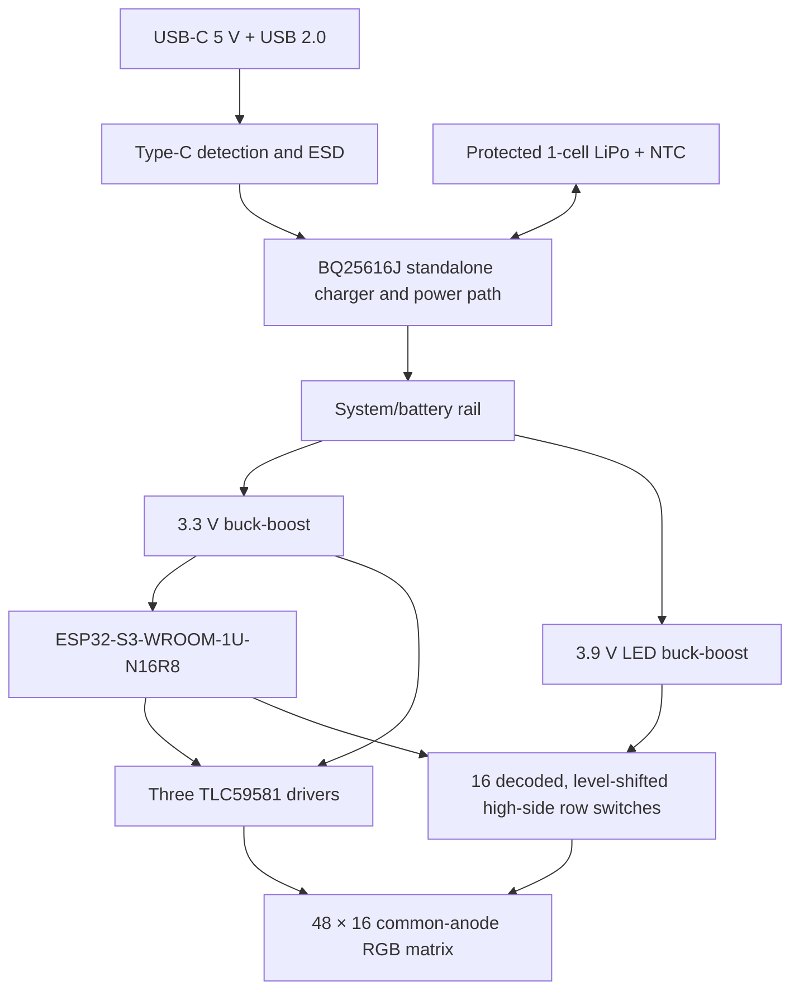

<!-- SPDX-License-Identifier: CERN-OHL-S-2.0 -->

# RGB Badge Hardware Project Plan

Status: agreed design baseline and staged execution plan
Date: 2026-09-05
Project phase: matrix, driver, row-stage and controller native reviews passed; power pre-capture arithmetic recorded; exact power libraries, power capture and layout remain

## 1. Outcome

Build a new, open-source, full-colour wearable LED badge inspired by the FOSSASIA Badge Magic form factor, while retaining its pixel pitch and meeting these product targets:

| Item | Agreed target |
|---|---:|
| Display | 48 × 16 individually controlled RGB pixels (768 pixels) |
| Pixel pitch | 1.95 mm, equal to the measured Badge Magic pitch |
| Finished envelope | no more than 110 × 35 × 11 mm, attachment excluded from thickness |
| Finished weight | aim for 75 g; absolute maximum 100 g, including battery, case and attachment |
| Runtime | roughly 6 h for the defined mixed-content reference workload at a suitable fixed brightness |
| Charging | USB-C, standard 5 V only, correct A-to-C and C-to-C behaviour |
| Charge-time target | approximately 80% in 45–60 min and full in 75–100 min, with the display off and a capable USB-C source |
| Wireless | Bluetooth Low Energy, enabled only in programming mode |
| Local controls | one momentary mode button and one latching on/off slide switch |
| Assembly | turnkey PCBA; the user only plugs in the battery and assembles the case |
| Initial full-badge quantity | 5 assembled boards |
| Build budget | USD 500–800 for coupon plus five Rev 1 badges, batteries and shipping; case filament and independent review excluded |

This is feasible, with one qualification: six hours cannot apply to arbitrary content at maximum brightness. The energy budget supports about six hours for mixed text/icons/animations at modest indoor brightness. Full-screen white at maximum permitted brightness will be closer to one to two hours. Brightness will never be silently or automatically reduced; the user chooses it when programming the badge.

## 2. Decisions already made

### Display and appearance

- The final display is 48 columns × 16 rows, not a stretched copy of the original 44 × 11 monochrome matrix.
- Every pixel has true red, green and blue control.
- The pitch is 1.95 mm. The centre-to-centre active span is 91.65 × 29.25 mm.
- With 1.5 mm LEDs, the luminous package envelope is about 93.15 × 30.75 mm.
- The PCB has black solder mask. The case is matte black PETG. PLA or ASA may be used for quick development prints.
- The front uses a thin smoked/frosted diffuser, replaceable during development.
- The badge should look good in static phone photographs. Video-camera performance is not a requirement, although the rendering pipeline remains capable of 60 frames/s.
- Colour processing supports 24-bit source art, gamma correction and programmable white balance. The fallback acceptance level is clean, saturated colour without demanding display-calibration-grade accuracy.

### Interaction and software boundary

- Normal operation plays stored content with the radio disabled.
- Holding the mode button for about three seconds enters programming mode and turns BLE on.
- Programming mode exits after a successful transfer or inactivity timeout and turns BLE off.
- A future phone app will set the content and fixed brightness and may estimate runtime. The app and final BLE protocol are not part of this hardware phase.
- USB-C data remains available for firmware recovery, diagnostics and development.
- Firmware is based on ESP-IDF and native C/C++, not Arduino as the production foundation.

### Power and safety behaviour

- A real slide switch controls the operating state. It controls regulator enables rather than carrying the complete LED current through a tiny mechanical contact.
- Switch OFF removes power from the display and battery-powered application electronics. Charging and battery gauging remain available.
- When USB is inserted while the switch is OFF, the standalone charger and hardware charge indicators operate, but the ESP32-S3, display drivers and both switched rails remain off. USB data is available only when the slide switch is ON.
- The badge can operate while charging. The charger gives the system load priority and allocates remaining input power to the battery.
- There is no ambient light sensor and no content-dependent dimming.
- Firmware may blank the display on undervoltage, overtemperature or a detected electrical fault. That is a safety shutdown, not automatic brightness control.

### Mechanical and sourcing

- One double-sided rigid PCB carries LEDs on the front and electronics on the rear. The battery, its lead and the external BLE antenna are separate fitted parts.
- The development case closes with two M2 screws and interlocking tabs. The final case may use snaps or adhesive and need not be user-openable.
- Attachment is a dual-magnet back, kept outside the battery and RF antenna zones.
- The design aims for sweat and incidental-splash resistance, but makes no IP-rating claim.
- Manufacturing files stay vendor-neutral: KiCad sources, Gerbers, drill files, BOM and component-placement file.
- Canonical electronics are authored with KiCad 10.0.6 stable; patch and major upgrades follow [ADR 0006](decisions/0006-kicad-10-workflow.md).
- JLCPCB is the quotation baseline; PCBWay and at least one vetted Alibaba turnkey PCBA supplier receive the identical package.
- Critical part substitutions are forbidden without a written engineering review.
- This is a non-commercial small batch. Formal product certification is out of scope, but the design still uses a pre-certified ESP32 module within its approved external-antenna conditions, a documented/protected battery pack, compliant USB-C behaviour and conservative electrical/mechanical safeguards.

## 3. Recommended electrical architecture

### 3.1 Block diagram



### 3.2 Pixel drive

Use discrete four-pad common-anode RGB LEDs in a 1:16 multiplexed matrix:

- Three TI TLC59581RTQ devices provide 144 constant-current cathode channels: 48 columns × 3 colours.
- Sixteen high-side P-channel MOSFET row switches energise one common-anode row at a time. Each gate has a pull-up to VLED and a small N-channel MOSFET pull-down, so a 3.3 V logic output never has to drive a 3.9 V P-channel gate directly.
- A 3.3 V, active-high 4-to-16 decoder with a global inhibit, provisionally 74HC4514-class, drives those N-MOS gate stages. Inhibit forces every N-MOS and therefore every row off during startup and row changes.
- The row-decoder enable is deasserted, the row address changes, a short settling interval is observed, and the next row is enabled. TLC59581 precharge and ghost-cancellation features remain available.
- One matched hardware current-reference resistor per driver limits the worst possible output even if firmware writes an invalid brightness value. Colour-group correction then balances red, green and blue.
- Initial design point: about 5 mA maximum per raw channel, with a nominal white balance near R 5 mA, G 2.5 mA, B 3 mA. The coupon determines the final values.
- Initial grayscale clock range: 8–16 MHz. Select the lowest rate that passes photograph, low-grayscale and flicker tests. This reduces driver power and EMI compared with blindly operating at the 33 MHz limit.
- In 8+8 ES-PWM mode, 257 GCLK pulses per row segment imply about 1.9–3.9 kHz visual refresh at 1:16 before row-transition dead time; content frames still update at 60 Hz. TI's [multiplexed-panel application note](https://www.ti.com/lit/pdf/SLVA744) recommends roughly 0.5–1 µs between row segments as a starting range, which the coupon must tune for its own discharge path.

The architecture is grounded in TI's multiplexed-panel work. The [TLC59581](https://www.ti.com/product/TLC59581) is an active 48-channel, 16-bit constant-current driver with display memory, per-colour correction, precharge, open-LED detection, 1:32 support and a 0.8 mA all-off power-save mode. TI's [TIDA-00161](https://www.ti.com/tool/TIDA-00161) reference design demonstrates the same family driving a much larger 64 × 64 common-anode RGB matrix on a four-layer board. Its [BOM](https://www.ti.com/lit/pdf/tidr688) identifies a 1 mm Harvatek common-anode RGB LED and the row-switch topology.

### 3.3 Why not addressable RGB LEDs

The tiny SK6805-EC15-style alternative is mechanically attractive but electrically wrong for this badge. Its [datasheet](https://cdn-shop.adafruit.com/product-files/4492/Datasheet.pdf) specifies about 0.5 mA static current per pixel. For 768 pixels:

`768 × 0.5 mA = 384 mA`

That is consumed before generating light. Six hours of idle electronics alone would require about 2.3 Ah, which cannot fit the agreed size and weight. The multiplexed matrix avoids 768 always-powered pixel controllers.

### 3.4 Controller and RF

Use ESP32-S3-WROOM-1U-N16R8:

- 16 MB flash for applications and stored content.
- 8 MB octal PSRAM for frame buffers, decompression and easy-to-write firmware.
- Bluetooth LE for future phone programming.
- Native USB for recovery, logging and factory test, eliminating a USB-to-UART bridge.
- External-antenna version (`1U`), measuring 18 × 19.2 × 3.2 mm, instead of the longer module with a PCB antenna.

The external-antenna module is deliberate. A PCB antenna would require a copper-free area through every layer, but the LED matrix occupies nearly the full front surface. A small certified-compatible 2.4 GHz FPC antenna can sit in a non-metallic case edge away from the battery, body, PCB copper and magnetic back. Both N16R8 variants and their dimensions are documented in Espressif's [module datasheet](https://documentation.espressif.com/esp32-s3-wroom-1_wroom-1u_datasheet_en.pdf).

The 16 MB flash target assumes compiled badge assets, not raw video. One uncompressed 24-bit frame is 2,304 bytes, or about 8.3 MB per minute at 60 frames/s. The host-side asset tool therefore stores palette-indexed frames, variable frame durations, changed rectangles/tiles and RLE or LZ-style deltas; text and sprite instructions remain procedural where useful. Reserve roughly 8–10 MB for content after dual application slots and system partitions. Coupon acceptance includes at least 24 representative animations totalling five minutes; highly noisy full-screen art may store less and must be reported rather than silently degraded.

The existing classic ESP32-WROOM-32 breadboard board can be used for content-file parsing, BLE state-machine sketches and other pure software. It should not be used as evidence that the final display, native USB, charger, RF layout or ESP32-S3 peripherals work.

### 3.5 USB-C and charging

The proposed input path is:

1. A low-profile, mechanically anchored USB 2.0 Type-C receptacle on the right short edge. GCT USB4500/4505 is a candidate series; final selection depends on the 1.0 mm PCB variant and assembly stock.
2. VBUS and USB data ESD protection close to the connector.
3. TUSB320LAI configured as a USB device/sink in GPIO mode. It identifies attachment and whether the source advertises default, 1.5 A or 3 A current. TI documents these GPIO states in the [TUSB320LAI datasheet](https://www.ti.com/lit/gpn/TUSB320LAI).
4. USB D+ and D− routed as a controlled differential pair to native ESP32-S3 USB, with the Espressif-recommended protection and series components.
5. TI BQ25616J standalone switching charger/power-path manager. Its `ICHG` resistor fixes battery charge current at approximately 0.8–0.9 A, never above the selected pack rating.
6. A fail-safe hardware resistor/analog-switch network on `ILIM`, controlled by TUSB320LAI `OUT1` (low only for an attached 1.5 A or 3 A advertisement), permits approximately 1.2 A input only in those states. Its unattached/default/passive state is 500 mA. Firmware is not in this safety loop.

The [BQ25616/BQ25616J datasheet](https://www.ti.com/lit/ds/symlink/bq25616.pdf) specifies an autonomous 3 A switch-mode charger, NVDC power path, resistor-programmed 0.3–3 A charge current, NTC monitoring, a 10-hour safety timer and 9.5 µA battery leakage with the system in standby. The BQ25616J variant applies a JEITA temperature profile. It can finish a charge with the MCU genuinely off and is a better thermal fit than dissipating roughly a watt in a linear 1 A charger inside a thin plastic badge.

The charger's BC1.2 `D+`/`D−` pins are provisionally left isolated so native USB data belongs only to the ESP32-S3; the charger then treats the input as an unknown 5 V adapter and obeys `ILIM`. Gate A must verify this exact state, the TUSB320-to-`ILIM` truth table, resistor tolerances, startup transients and the passive 500 mA fallback against both TI datasheets before layout. If an engineer rejects that implementation, use a dedicated hardware USB-data switch or a different standalone charger—never an MCU-dependent current-limit increase.

Fast-charge timing is conditional:

- Target 80% in 45–60 min assumes a new 750–900 mAh cell whose datasheet allows approximately 1 C charging, display off or lightly loaded, and a USB-C source advertising at least 1.5 A.
- A-to-C and default-current C-to-C sources are intentionally limited and take longer.
- Heavy display use consumes input power first and extends charge time.
- The final charge current is never set above the exact pack supplier's rating.

Two tiny side-facing LEDs next to USB-C indicate red while charging and green when complete. The circuit should derive a useful indication from charger status even before full application firmware is installed.

### 3.6 Power rails and shutdown

| Rail | Provisional implementation | Purpose |
|---|---|---|
| SYS/BAT | BQ25616J power-path output | Selects USB/battery, supports autonomous charging and charge-through operation |
| 3V3 | TPS631000-class 1.5 A buck-boost | ESP32-S3, TLC logic and low-voltage logic |
| VLED | TPS63020-class high-current buck-boost at about 3.9 V | Row anodes and LED optical power |
| Battery state | MAX17048G+ in 2 × 2 mm TDFN | State-of-charge independent of simple voltage readings |
| Battery current | INA232 with approximately 10 mΩ shunt | Bidirectional current/power telemetry while the application is on |

The [TPS631000](https://www.ti.com/product/TPS631000) provides a compact SOT-package buck-boost rail with 1.5 A output capability and low quiescent current. The [TPS63020](https://www.ti.com/product/TPS63020) is active, supports a 1.8–5.5 V input and substantially more current than the matrix requires. The [MAX17048](https://www.analog.com/en/products/max17048.html) uses ModelGauge without a current-sense resistor and is available in an assembly-friendly 2 × 2 mm TDFN package; its datasheet specifies 3 µA hibernate and 23 µA active current.

The latching switch controls both switched-regulator enables. The charger, fuel gauge and hardware charge-status circuit are upstream of that switch:

| Slide switch | USB present | Application/USB data | Charging | Display |
|---|---|---|---|---|
| OFF | No | Off | No | Off |
| OFF | Yes | Off | Yes, autonomous | Off |
| ON | No | Normal battery playback | No | On |
| ON | Yes | Normal playback plus USB data | Yes, with power-path load priority | On |

The charger and fuel gauge stay connected to the protected cell. The INA232 is powered only with 3V3; its datasheet permits the monitored common-mode voltage to remain present with its supply off. The design target for switch-OFF battery drain, after USB removal, is below 50 µA.

### 3.7 Battery

Start with a standard reputable LiPo cell and have the battery vendor add:

- a one-cell protection circuit;
- a 10 kΩ NTC compatible with the charger profile;
- a keyed three-wire low-profile connector;
- strain relief and insulated protection-board terminations;
- documentation for the exact assembled pack, not only a generic cell family.

The most promising standard cells are:

| Candidate | Capacity | Cell dimensions | Cell weight | Status |
|---|---:|---:|---:|---|
| [EEMB LP603048](https://www.eemb.com/product-146) | 900 mAh | 30.5 × 32 × 6.3 mm | 18 g | Runtime favourite; thickness must be proven in CAD |
| [EEMB LP503048](https://www.eemb.com/product-201) | 750 mAh | 30.5 × 50 × 5.3 mm | 15 g | Safer thickness fallback |
| [EEMB LP453048](https://www.eemb.com/product-209) | 710 mAh | 30.5 × 50 × 4.8 mm | 14.2 g | Thin fallback if enclosure stack is tight |

The cited EEMB listings show UN38.3 plus IEC62133 and/or UL1642 compliance at cell level. Before purchase, obtain the exact pack drawing, maximum charge/discharge currents, protection thresholds, connector polarity and reports applicable to the terminated pack. Do not use an unbranded AliExpress pouch cell.

No pouch cell may be clamped between screw bosses or magnets. The case includes edge clearance, a smooth cradle, strain relief and swelling allowance. No component or solder joint is allowed to press into the pouch.

## 4. Geometry, PCB and enclosure

### 4.1 Preliminary geometry

| Element | Preliminary value |
|---|---:|
| PCB | approximately 106 × 32.5 × 1.0 mm |
| Complete case | target 109 × 35 × 10.5–11 mm |
| Pixel centre pitch | 1.95 mm |
| Pixel centre span | 91.65 × 29.25 mm |
| LED package envelope, 1515 | approximately 93.15 × 30.75 mm |
| USB-C | right short edge |
| Button and switch actuators | top long edge |
| FPC antenna | case edge, separated from magnets and battery |

These are layout starting values, not permission to exceed the finished envelope. The CadQuery model and KiCad STEP export must be assembled before layout freeze.

### 4.2 Final PCB recommendation

- Six layers, 1.0 mm FR-4, standard through vias if routing can pass without HDI.
- ENIG finish for the fine LED/QFN pads and consistent coplanarity.
- Black solder mask; minimal front silkscreen within the viewing area.
- One uninterrupted ground reference layer and deliberate power layers/regions for VLED and row current.
- Short, Kelvin-correct feedback and current-reference routing.
- USB data impedance controlled to the fabricator's stack-up.
- Switching-regulator loops confined to the rear and kept away from USB and RF.
- Panel rails with global/local fiducials and tooling holes; optical polarity marks remain outside the visible region.
- No copper, magnets or battery directly adjacent to the external FPC antenna's keepout.
- Hidden Tag-Connect-compatible or custom pogo pads for EN, GPIO0/mode, UART, USB/JTAG recovery, ground, rails, I²C and display timing.

The mode button can share the ESP32-S3 boot-strapping function: hold it while switching on to enter ROM recovery. This avoids adding a second user-facing button. Hidden EN and debug pads remain available to a pogo fixture.

### 4.3 Parametric enclosure

Create the enclosure in CadQuery and export STEP and STL. Parameters include PCB length/width/thickness, diffuser thickness/gap, battery envelope and swelling allowance, connector cut-outs, actuator locations, antenna zone, magnet cavities, screw bosses and gasket compression.

Development enclosure:

- PETG, 0.4 mm nozzle, normally 0.2 mm layers.
- Two M2 screws plus interlocking tabs.
- Replaceable 0.5–0.8 mm smoked/frosted polycarbonate diffuser.
- A shallow diffuser lip or thin gasket to reduce sweat ingress.
- Recessed or guarded slide switch to prevent accidental operation.
- USB opening with a drip lip; optional removable port plug.
- Battery access for development, with no tool contact near the pouch.

After electrical validation, a final shell can use snaps/adhesive and rear-side conformal coating on appropriate PCB regions. Do not coat connectors, switches, button contacts, test pads or RF parts. Splash resistance is demonstrated by a defined test; it is not described as an IP rating.

### 4.4 Weight budget

| Assembly | Design allocation |
|---|---:|
| Complete populated PCB | ≤18 g |
| Protected 900 mAh pack, lead and connector | ≤21 g |
| Printed shell and diffuser | ≤18 g |
| Two magnets and garment backer | ≤15 g |
| Antenna, screws, gasket and adhesive | ≤3 g |
| **Target total** | **≤75 g** |

A 106 × 32.5 × 1.0 mm FR-4 substrate is approximately 6.4 g before copper and components, so the allocation is realistic. Every physical revision is weighed; the 100 g limit is a hard stop, not a goal.

## 5. Runtime model

Runtime must be specified with a reference workload, brightness and battery—not simply advertised as “six hours.” Initial calculation assumptions:

- selected white-balance peak current totals about 10.5 mA per active pixel;
- 48 pixels are active in the selected row;
- VLED is 3.9 V;
- LED-rail conversion efficiency is 88%;
- non-LED battery power is provisionally 0.25 W;
- a new pack provides 85% of nominal watt-hours before cutoff and conversion margins.

At full-screen, full-brightness white, LED rail power is approximately:

`48 × (5 + 2.5 + 3) mA × 3.9 V = 1.97 W`

The rough battery-power model is therefore:

`Pbattery ≈ 0.25 W + (1.97 W × lit-pixel fraction × brightness fraction / 0.88)`

| Reference case | Lit-pixel fraction | Manual brightness | Estimated battery power | 900 mAh estimate | 750 mAh estimate |
|---|---:|---:|---:|---:|---:|
| Mixed conference content | 35% | 25% | 0.45 W | about 6.3 h | about 5.3 h |
| Bright mixed content | 50% | 40% | 0.70 W | about 4.0 h | about 3.4 h |
| Full white stress pattern | 100% | 100% | 2.49 W | about 1.1 h | about 1.0 h |

These are calculations, not measurements. The coupon replaces every provisional value with logged battery current, VLED power and temperature. The six-hour target requires no more than about 0.47 W average from a 900 mAh cell or 0.39 W from a 750 mAh cell under the stated 85% assumption.

The future app's estimate should process the actual frames after gamma/white-balance mapping and combine their average electrical intensity with measured board idle power and the selected battery profile. It should not change brightness itself.

## 6. Coupon-first development plan

The first production-intent hardware is not an off-the-shelf HUB75 panel. It is a small functional coupon that exercises every risky circuit used by the badge.

### 6.1 Coupon contents

- 16 × 16 RGB pixels at 1.95 mm pitch.
- Columns 0–7 populated with Everlight `EAST10105RGBA0`, a clear 1010 common-anode LED.
- Columns 8–15 populated with QT Brightek `QBLP1515A-RGB2A`, a white-diffused 1515 common-anode LED.
- One TLC59581, all 16 level-shifted row switches and the production row decoder/inhibit circuit.
- ESP32-S3-WROOM-1U-N16R8 and external FPC antenna.
- Production-intent USB-C, Type-C detection, ESD, charger, fuel gauge, 3V3/VLED converters, NTC interfaces, slide switch and mode button.
- Production-intent INA232 and approximately 10 mΩ battery-path shunt for bidirectional voltage/current/power telemetry over USB serial while the badge is on.
- Optional coupon-only second INA232 and shunt on VLED, if routing/cost permit, to separate display power from controller power.
- Test pads for VBUS, BAT, SYS, 3V3, VLED, ground, I²C, USB, SPI/GCLK/latch, row-decoder enable and row-address signals.
- Factory Tag-Connect-compatible or custom pogo footprint for flashing and a minimal functional test.

Order five coupon PCBs and have three assembled. This gives one working unit, one comparison/repeat unit and one failure-analysis spare without paying to populate every bare board.

### 6.2 LED selection gate

Before releasing the coupon:

1. Obtain datasheets and enough same-lot parts for assembly plus attrition.
2. Lock common-anode pinout, polarity mark, land pattern, reflow profile and moisture sensitivity.
3. Populate columns 0–7 with [Everlight EAST10105RGBA0](https://www.mouser.com/datasheet/2/143/EAST10105RGBA0-1709851.pdf).
4. Populate columns 8–15 with [QT Brightek QBLP1515A-RGB2A](https://www.qt-brightek.com/datasheet/QBLP1515A-RGB2A.pdf).
5. Verify both exact footprints, pad numbering, polarity marks, tape orientation, reflow requirements and controlled optical bins against manufacturer documentation.
6. Never change LED manufacturer, package, pinout or optical bin during PCBA quoting without regenerating the BOM and approving a new coupon population.

Coupon tests compare brightness per watt, off-state contrast, diffuser uniformity, colour balance, viewing angle, camera banding, solder yield and routing margin. The winner becomes the single final-badge LED; the split arrangement is not carried into production.

### 6.3 Minimal equipment

Already available: multimeter, breadboard leads and soldering tools (manual soldering is not required).

Purchase or borrow:

| Item | Purpose | Suitable source |
|---|---|---|
| Logging USB-C power meter, about USD 15–30 | Input volts/amps/watt-hours and charge timing | AliExpress is acceptable |
| 8-channel 24 MHz-class USB logic analyser, about USD 8–20 | GCLK, SPI, latch, row-enable and row-address timing | AliExpress is acceptable |
| Contact thermocouple thermometer, about USD 15–30 | Independent battery and case temperature check | AliExpress or local supplier |
| Reputable 5 V USB-C charger and both C-to-C/A-to-C cables | Current-advertisement and compatibility tests | Established consumer-electronics retailer |

The board remains self-reporting so ordinary bring-up does not require an oscilloscope or bench supply. If a signal-integrity fault appears, borrow/rent an oscilloscope or use the independent reviewer rather than guessing from logic-analyser traces.

### 6.4 Coupon bring-up order

1. Vendor AOI, polarity inspection and resistance checks before power.
2. Flash factory firmware through the pogo pads.
3. Power from USB with no battery and VLED disabled.
4. Turn the slide switch ON; confirm 3V3, native USB enumeration, reset/boot mode and the MAX17048/INA232 I²C device IDs.
5. With the application alternately ON and OFF, confirm Type-C default/1.5 A/3 A detection, hardware `ILIM` selection and conservative startup current.
6. Enable VLED without scanning; confirm voltage, quiescent current and shutdown.
7. Scan one pixel at the lowest current, then one colour, one row and walking rows.
8. Run solid colours, checkerboards, gradients, low-gray patterns and the mixed-content reference animation.
9. Photograph at common phone shutter/exposure settings and test for bands, ghosting and colour breakup.
10. Plug the protected battery in, verify polarity and NTC, then test charge/discharge and switch states.
11. Log repeated full-charge/reference-runtime cycles and thermal data.
12. Test BLE programming mode, radio-off playback current and worn-body range.

### 6.5 Coupon pass criteria

| Area | Pass condition |
|---|---|
| Power-off | less than 50 µA from battery with USB absent |
| Rails | all rails within component/design tolerance; no unstable startup or audible behaviour |
| USB | native USB enumerates with A-to-C and C-to-C; no orientation sensitivity |
| Current compliance | default source is not overdrawn; higher current is used only after valid advertisement |
| Charging | correct NTC behaviour, termination and charge indication; target timing on a capable source |
| Charge-through | display remains stable while charging; charger reduces battery current rather than collapsing USB |
| Matrix | no dead/incorrect pixels, visible ghosting or low-gray instability |
| Photographs | no objectionable banding in agreed static-phone-photo tests |
| Colour | usable gamma ramp, white balance and saturated primaries through the chosen diffuser |
| Runtime | measured reference workload supports the chosen cell/brightness target, or documents the brightness needed for six hours |
| Storage | at least 24 representative text/icon/animation assets totalling five minutes fit alongside two application slots |
| Thermal | cell stays within its charge/discharge specification; enclosure-facing and IC temperatures retain conservative margin |
| BLE | reliable programming-mode connection at 3 m line-of-sight and normal worn orientation |
| Assembly | LED polarity/yield and fine-pitch joints are repeatable enough for the five-board run |

## 7. Full-badge implementation

Only after coupon sign-off:

1. Replicate the proven 16-column driver block three times.
2. Retain the same charger, regulators, controller, antenna, controls, connector and test firmware.
3. Route the 48 × 16 matrix on the final six-layer outline.
4. Complete the CadQuery enclosure and check the STEP assembly for cell compression, USB access, antenna keepout and actuator travel.
5. Run KiCad ERC/DRC, vendor DFM and an independent electrical/layout review.
6. Generate immutable release artifacts with hashes and quote all three assembly vendors.
7. Order five fully assembled boards. Do not install batteries at the PCBA factory unless the selected vendor has an approved LiPo-pack integration and shipping process.
8. Bring up one board completely before plugging batteries into the remaining four.
9. Run acceptance tests and record serial-numbered results.

Final acceptance:

- complete case no larger than 110 × 35 × 11 mm;
- each complete badge below 100 g and design target at or below 75 g;
- 48 × 16 RGB pixels at 1.95 mm pitch;
- user-selected fixed brightness with no automatic dimming;
- approximately six hours at the published reference content/brightness with a new selected pack;
- safe 5 V USB-C charging and USB data in both orientations;
- target fast charge on a capable source, with slower compliant fallback;
- full operation during charging;
- BLE off in playback and on only during programming mode;
- correct button/switch/status indicators;
- repeatable static-phone-photo quality;
- no battery pressure points and successful defined sweat/splash demonstration.

## 8. Firmware scope for hardware validation

The coupon firmware is intentionally small but production-shaped:

- board pin map and hardware revision held in one machine-readable definition;
- native USB serial/JTAG recovery and diagnostic console;
- MAX17048 and INA232 drivers with register/configuration readback, plus GPIO readback for Type-C and charger-status states;
- deterministic TLC59581 scan engine using hardware timers/DMA where practical;
- boot-time all-rows-off and VLED-off defaults;
- test patterns, gamma LUT, colour correction and fixed brightness setting;
- telemetry: battery voltage/current/power, state of charge, board temperature, USB attachment/current advertisement and charger `PG`/`STAT` state;
- three-second mode-button state machine;
- BLE programming-mode skeleton and a small CRC-checked test transfer into flash;
- playback mode that explicitly releases/stops BLE resources;
- watchdog, brownout logging and safe display blanking on faults;
- manufacturing self-test with machine-readable PASS/FAIL output.

Suggested 16 MB flash layout reserves two application slots for future OTA/recovery and most remaining space for a versioned, CRC-protected content filesystem. Exact partition sizes are frozen only after the validation firmware is linked.

Vibe-coding guardrails:

- Treat manufacturer datasheets and the checked-in pin map as source of truth.
- Require every generated register driver to read back device identity/configuration during tests.
- Keep display timing, power state and BLE state as separate modules with explicit state machines.
- Simulate/host-test asset parsing, gamma conversion, frame scheduling and runtime-estimator math.
- Keep a deterministic host-side asset compiler so content capacity and decoded pixels can be tested without the future phone app.
- Do not accept generated schematic symbols or footprints without checking every pin number against the manufacturer drawing.
- Treat battery-charge and USB input-current limits as schematic/BOM safety parameters. Production firmware has no path to raise them.

## 9. Repository and release contents

```text
rgb-badge/
├── CONTEXT.md
├── LICENSES/
├── NOTICE
├── docs/
│   ├── requirements.md
│   ├── decisions/
│   ├── bring-up/
│   ├── test-results/
│   └── sourcing/
├── hardware/
│   ├── coupon/rev-a/
│   └── badge/rev-a/
├── manufacturing/
│   ├── coupon/rev-a/
│   └── badge/rev-a/
├── mechanical/
│   ├── cadquery/
│   └── exports/
├── firmware/
│   ├── main/
│   ├── components/
│   └── test/
└── tools/
```

Each hardware release includes:

- editable KiCad schematic and PCB;
- project-local symbols, footprints and 3D models;
- PDF schematic;
- STEP assembly;
- Gerber/drill archive;
- BOM with manufacturer, exact MPN, approved source and substitution policy;
- component placement file with side/rotation and polarity notes;
- fabrication/assembly drawing and stack-up;
- programming image and factory-test instructions;
- ERC, DRC and DFM reports;
- release manifest with SHA-256 hashes;
- known issues and measured test report.

The new design is created cleanly, with the FOSSASIA project used as an attributed reference rather than copied as a layout. The [Badge Magic hardware repository](https://github.com/fossasia/badgemagic-hardware) and its Apache-2.0 licence are cited in NOTICE. Hardware, mechanical, manufacturing and hardware-documentation sources use CERN-OHL-S-2.0; firmware and software tooling use Apache-2.0.

## 10. Sourcing strategy

### 10.1 What to source where

| Category | Preferred source | Alibaba/AliExpress role |
|---|---|---|
| ESP32-S3, TLC59581, charger, gauges, converters, USB-C controller | Manufacturer-authorised distributor or traceable LCSC/JLC global sourcing | Do not buy loose critical ICs from anonymous marketplace sellers |
| RGB LEDs | Authorised source for reference parts plus samples/direct quote from established display-LED manufacturers | Alibaba is useful for 1010/1515 display LEDs after datasheet, sample and coupon qualification |
| LiPo pack | Reputable cell/pack manufacturer or authorised local source | Alibaba only for a named manufacturer with exact-pack reports; avoid unbranded AliExpress cells |
| PCBA | JLCPCB and PCBWay | Quote a verified turnkey Alibaba CM against the same frozen package |
| Magnets, M2 hardware, diffuser stock, gaskets, test leads | Commodity suppliers | AliExpress is appropriate |
| USB meter, logic analyser, thermometer | Known test-tool seller | AliExpress is appropriate for non-safety-critical development tools |

Examples found during research include an [Alibaba common-anode 1010 RGB listing](https://www.alibaba.com/product-introduction/Very-Small-size-SMT-Type-Red_62506077730.html) and broader 1010/1515 display-component listings. They establish availability, not qualification. Listing prices can refer to a reel, bag, minimum order or an unmatched optical bin and must not be copied directly into the BOM.

### 10.2 Supplier qualification rules

For LEDs, require:

- legal manufacturer name and exact part number;
- current datasheet and package drawing;
- common-anode pin map and polarity mark;
- wavelength/intensity bin and bin-mixing policy;
- test data at the intended low/pulsed current and 1:16 duty;
- black/white body and lens/diffusion description;
- MSL, reflow profile, reel orientation and date code;
- RoHS/REACH declaration;
- enough same-lot parts for the build plus at least 5–10% attrition.

For an Alibaba PCBA supplier, require:

- a business/manufacturing audit or credible third-party verification;
- IPC-A-610 Class 2 workmanship agreement;
- 100% AOI and electrical test;
- sample X-ray or process evidence for exposed-pad QFNs;
- double-sided fine-pitch LED placement capability and stated minimum package/pitch;
- exact-MPN purchase records for critical ICs;
- no substitutions without written approval;
- factory programming through the supplied pogo fixture and a serialised test log;
- delivered photos of first article before the balance ships.

JLCPCB currently publishes separate setup, stencil and per-joint assembly charges; the online quote remains authoritative for the actual design. Its [assembly pricing page](https://jlcpcb.com/help/article/pcb-assembly-price) and [global sourcing instructions](https://jlcpcb.com/help/article/how-to-use-jlcpcb-global-sourcing-parts-service) show that externally sourced parts can be held for an assembly order. Do not pre-order non-refundable reels until the schematic, footprint and coupon BOM are frozen.

## 11. Cost plan

All figures are planning ranges in USD as of 2026-09-05; freight, tax, stock and assembly classification can move them materially.

| Phase | Planning range |
|---|---:|
| LED samples/reels and small sourcing fees | 30–70 |
| USB meter, logic analyser and thermometer | 35–60 |
| Five coupon PCBs, three assembled, parts and first shipping | 90–140 |
| Five full six-layer assembled boards | 240–330 |
| Five protected, terminated cells | 45–70 |
| Final shipment, duties and contingency | 50–90 |
| Diffuser, magnets and fasteners; case filament excluded | 20–40 |
| **Budgeted project build total** | **510–800** |

These are target allocations, not supplier quotations. The lower end depends on the selected LEDs being available to the assembler and the full PCB routing without HDI. The most cost-sensitive parts are the three TLC59581s per badge, double-sided assembly, non-stock component sourcing and shipping—not the raw count of ordinary SMT joints. Gate A must rebaseline this table from written quotes; if the total exceeds USD 800, pause and choose explicitly between a different qualified assembler, fewer coupon assemblies or a larger budget rather than substituting safety-critical parts.

Keep the independent review outside this build allocation, as agreed. Obtain its quote before coupon release so it does not become a surprise blocker.

## 12. Main risks and planned responses

| Risk | Early evidence | Planned response |
|---|---|---|
| Six hours needs lower brightness than expected | Coupon average exceeds 0.47 W with 900 mAh | Publish measured curve; user selects a lower fixed brightness; do not auto-dim |
| 900 mAh cell makes the case too thick | STEP stack or print exceeds 11 mm / presses pouch | Use 750 or 710 mAh standard cell; only then evaluate a certified custom thin pack |
| Driver baseline power is too high | All-black scan power materially exceeds budget | Lower valid GCLK, use power-save during blank intervals/content, optimise ESP clock; do not reduce pixel density |
| 1010 LED is dim or hard to assemble | Poor coupon efficacy/yield | Select qualified 1515 while keeping 1.95 mm pitch |
| 1515 package hurts contrast | Visible white package through diffuser | Select black-face display LED or adjust diffuser after coupon comparison |
| Matrix routing fails standard rules | DRC congestion on 1.95 mm grid | Use six layers and tighter standard rules; HDI only after a cost review |
| Camera banding/ghosting | Coupon photos or low-gray patterns fail | Raise GCLK/visual refresh, tune blanking/precharge and row timing |
| BLE range is poor when worn | Dropouts around body/magnets | Move/tune FPC antenna within reserved case zones; keep 1U module |
| Charger overheats during operation | Thermal log shows regulation or hot case | Lower the fixed charge current or add switch-state hardware derating; improve copper spreading; retain full operation |
| USB source is overdrawn | Meter shows >default current without a valid higher-current advertisement | Passive 500 mA `ILIM`; hardware-only increase after valid Type-C detection; validate every attach/detach truth-table transition |
| Marketplace substitution changes pinout/bin | Quote or incoming reel differs | Exact MPN lock, first-article photo, incoming inspection and re-coupon if needed |
| LiPo mechanical damage | Fit interference or local pressure marks | Battery keepout, smooth cradle, swelling clearance and independent mechanical review |

## 13. Review gates and immediate next work

### Gate A — before coupon quotation

- Exact 1010 and 1515 MPNs locked; project-local footprints, polarity, tape orientation and optical bins independently checked.
- Battery cell/terminated-pack drawing and electrical limits obtained.
- Schematic ERC clean and power tree reviewed.
- USB-C default-current behaviour, isolated charger data pins and TUSB320-to-`ILIM` hardware truth table proven by design review.
- Converter calculations and layouts checked against manufacturer guidance.
- Coupon PCB DRC and vendor DFM clean.
- Independent electronics engineer reviews LiPo charging, high-current LED rail, USB-C and PCB layout.

### Gate B — before full badge layout release

- Coupon pass criteria complete with logs and photographs.
- Winning LED, diffuser, peak currents, GCLK and reference brightness frozen.
- Measured runtime model replaces estimates.
- Battery capacity/thickness choice frozen.
- Antenna location proven while worn.

### Gate C — before ordering five full assemblies

- Complete PCB/enclosure STEP collision check.
- Weight estimate below 75 g with named purchased parts.
- Schematic/layout second review complete.
- Three comparable written quotations received.
- Exact BOM stock reserved without silent substitutions.
- Manufacturing test firmware and fixture drawing ready.

### Immediate deliverable sequence

1. Create the repository skeleton, requirements, pin map and decision records.
2. Record the completed owner KiCad review of the controller increment.
3. Capture the exact USB-C, charger, gauge and switched 3.3 V/VLED power sheet with hardware-safe defaults.
4. Review the complete schematic and run the power calculations against exact selected parts.
5. Lay out the coupon, generate its STEP model and perform DFM.
6. Produce Gerbers, BOM, placement file, assembly drawing, factory firmware and bring-up checklist.
7. Obtain independent review and three PCBA quotes.
8. Order the coupon only.
9. Use its measured results to authorise—or revise—the full badge.

This staged route validates the actual driver, LEDs, ESP32-S3, USB-C, charger, battery, RF and firmware interfaces. It avoids spending the five-board budget on a full-size PCB before the two genuine unknowns—optical efficiency and system power—have been measured.

## 14. Primary references

- [FOSSASIA Badge Magic hardware repository](https://github.com/fossasia/badgemagic-hardware)
- [TI TLC59581 product page and datasheet](https://www.ti.com/product/TLC59581)
- [TI TLC59581 multiplexed-panel application note](https://www.ti.com/lit/pdf/SLVA744)
- [TI TIDA-00161 multiplexed RGB panel reference design](https://www.ti.com/tool/TIDA-00161)
- [TI TIDA-00161 bill of materials](https://www.ti.com/lit/pdf/tidr688)
- [TI BQ25616/BQ25616J standalone charger/power-path datasheet](https://www.ti.com/lit/ds/symlink/bq25616.pdf)
- [TI TUSB320LAI USB-C controller datasheet](https://www.ti.com/lit/gpn/TUSB320LAI)
- [TI INA232 current/power monitor datasheet](https://www.ti.com/lit/gpn/INA232)
- [TI TPS63020 high-current buck-boost](https://www.ti.com/product/TPS63020)
- [TI TPS631000 compact buck-boost](https://www.ti.com/product/TPS631000)
- [Analog Devices MAX17048 fuel gauge](https://www.analog.com/en/products/max17048.html)
- [Espressif ESP32-S3-WROOM-1/1U datasheet](https://documentation.espressif.com/esp32-s3-wroom-1_wroom-1u_datasheet_en.pdf)
- [USB-IF USB Type-C specification](https://www.usb.org/sites/default/files/USB%20Type-C%20Spec%20R2.0%20-%20August%202019.pdf)
- [QT Brightek QBLP1515A-RGB2A datasheet](https://www.qt-brightek.com/datasheet/QBLP1515A-RGB2A.pdf)
- [EEMB candidate LiPo cells](https://www.eemb.com/products-55)
- [JLCPCB PCBA pricing](https://jlcpcb.com/help/article/pcb-assembly-price)
